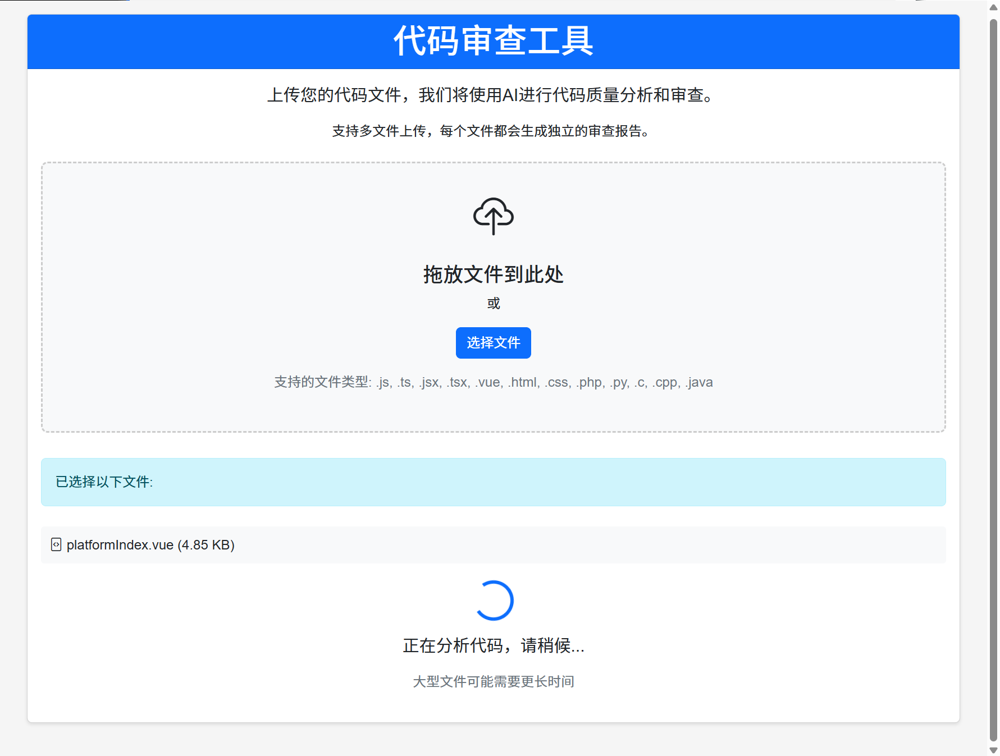
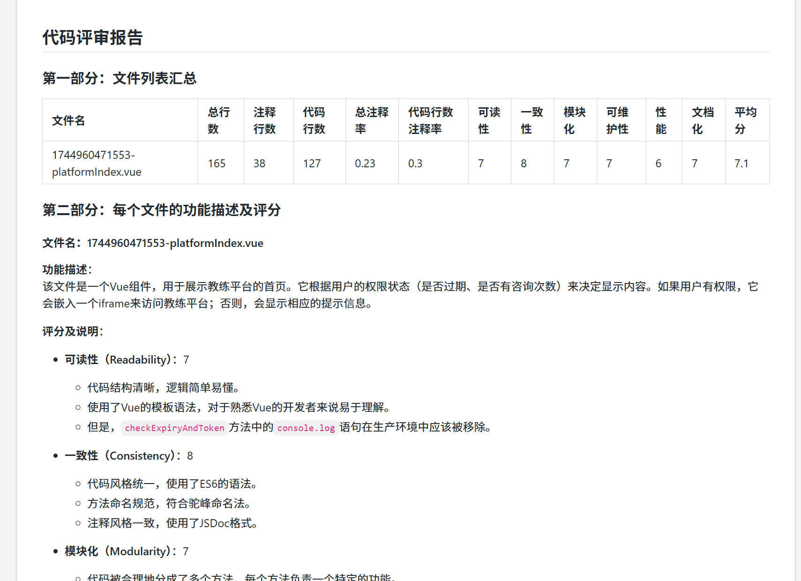

# 代码审查工具 (Web版)

这是一个基于Web界面的代码审查工具，使用AI技术自动分析和评估代码质量。

## 功能特点

- 支持多文件上传和批量分析
- 统计代码行数、注释率等指标
- 使用大语言模型进行代码质量评估
- 评估代码可读性、一致性、模块化、可维护性、性能和文档化质量
- 生成详细的Markdown格式报告
- 美观的Web界面展示结果

## 安装与使用

### 前提条件

- Node.js v14+
- npm或yarn包管理器
- OpenAI API密钥或类似LLM服务提供商

### 安装步骤

1. 克隆或下载本仓库
2. 安装依赖：
   ```bash
   cd web_code_review
   npm install
   ```
3. 设置环境变量：
   - 复制`.env.example`文件为`.env`
   - 填写必要的API密钥和配置

### 启动服务

```bash
npm start
```

服务默认启动在 http://localhost:3000

## 使用方法

1. 打开浏览器访问 http://localhost:3000
2. 将代码文件拖放到指定区域或点击选择文件按钮上传
3. 等待服务器处理，处理时间取决于文件大小和复杂度
4. 查看生成的代码审查报告

## 支持的文件类型

- JavaScript (.js)
- TypeScript (.ts, .tsx)
- JSX (.jsx)
- Vue (.vue)
- HTML (.html)
- CSS (.css)
- PHP (.php)
- Python (.py)
- C/C++ (.c, .cpp)
- Java (.java)

## 环境变量说明

项目使用`.env`文件存储环境变量，主要包括：

- `PORT`: 服务监听端口，默认3000
- `OPENAI_API_KEY`: OpenAI API密钥
- `OPENAI_API_BASE`: OpenAI API基础URL
- `OPENAI_API_MODEL`: 使用的模型名称

## 技术栈

- 后端: Node.js, Express
- 前端: HTML, JavaScript, Bootstrap
- 代码分析: node-sloc
- AI集成: OpenAI API 

## 示例：



